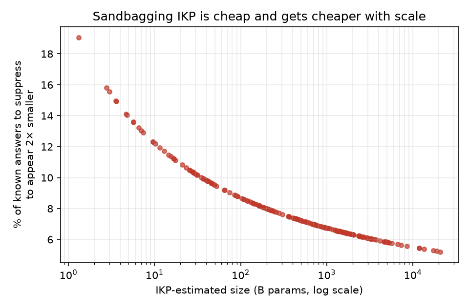

# Adversarial robustness of IKP

*A companion analysis to Incompressible Knowledge Probes (IKP). Reproduce
with `python scripts/17_adversarial_robustness.py`.*

IKP estimates a black-box model's parameter count from its factual
accuracy. An estimator is only trustworthy if the party being measured
cannot cheaply move it. This note quantifies how cheap the two directions
of gaming actually are, using the real per-tier verdicts of all 201 models
in `data/results/evaluation_summary.json` (no new API calls; fully
reproducible). All numbers use the default no-penalty scoring (λ=0), where
only correct answers move the score.

## Threat model

A model *operator* controls what the API returns and wants to misreport
scale. Two attacks:

- **Sandbagging (appear smaller).** Return "I don't know" on a fraction
  `p` of questions the model actually knows. Motivations: evade
  capability-disclosure or scaling-based policy, hide a distillation
  lineage, undercut a competitor's size claim.
- **Contamination (appear larger).** Having seen the probe set, convert a
  fraction `q` of otherwise-wrong answers into correct ones (rote
  memorization / benchmark leakage). Motivation: market a small model as
  frontier-scale.

Because IKP scores `accuracy = mean_tier(correct/total)`, sandbagging
scales accuracy by `(1 − p)` and the induced size shift has a closed form:

```
Δ log10(params) = − accuracy · p / slope        (slope ≈ 0.149 at λ=0)
```

## Result 1 — sandbagging is cheap, and *cheaper* the bigger you are

To make itself look **2× smaller**, the median model need suppress only
**~7.4%** of the answers it knows; **5× smaller** costs **~17%**. And the
cost *falls* with true scale, because larger models have higher accuracy,
so each withheld answer moves the estimate further:

| IKP-estimated size | suppress to look 2× smaller |
|---|---|
| ~10 B    | ~12% |
| ~230 B   | ~8%  |
| ~1.5 T   | ~6.5% |
| frontier (>3 T) | ~5–6% |



This is the uncomfortable finding: **the models with the most to hide are
the easiest to hide.** Worse, the attack is invisible to a pure black-box
auditor — a high refusal rate is indistinguishable from genuine ignorance
or safety tuning, which is exactly the "refused-but-known" gap the IKP
paper already flags for heavily safety-tuned models.

## Result 2 — inflation is possible but needs probe-set access

Making a model look **2× larger** costs, at the median, converting **~12%**
of its wrong answers to correct — but this requires *knowing the probe
answers in advance*. Contamination is bounded by the accuracy ceiling, so
already-strong models can barely inflate (they have little headroom),
while a weak model with lots of wrong answers can be pumped up
substantially. Unlike sandbagging, this attack leaves a signature and has
a clean defense.

## Defenses (what a robust IKP v2 should adopt)

1. **Held-out / rotating probe pools.** Neutralizes contamination: a
   memorized public set buys nothing on a fresh private split. Cheap to do
   given the 1,400-probe budget and the generator pipeline already in the
   repo.
2. **Refusal accounting.** Report an explicit refusal rate and a
   *sandbagging-adjusted upper bound* alongside the point estimate, so an
   auditor sees "≥ X B if refusals are genuine, up to Y B if they are
   strategic." The λ-penalty machinery is already present; this note argues
   it should be surfaced as an interval, not collapsed to one number.
3. **Consistency / paraphrase probes.** A genuinely ignorant model is
   ignorant across paraphrases; a sandbagger must refuse consistently on
   semantically identical items, which is detectable with paraphrase
   clusters.
4. **Cross-checking against non-suppressible signals.** Latency, tokenizer
   fingerprints, and logit-lens signals are harder to fake than refusals;
   pairing IKP with them raises the cost of sandbagging.

## Why this matters beyond IKP

The core asymmetry — **an unfakeable-upward proxy is still fakeable
downward unless withholding is itself detectable** — is general to any
"score a black box from costly-to-fake behavior" scheme. It is the same
tension a GitHub-account scorer faces with PR-farming and star inflation.
The general treatment of costly-to-fake proxy estimation and its
gaming-resistance bounds is proposed as follow-up work (see the
"incompressible proxy estimation" issue).

*Limitations: attacks are simulated by re-scoring recorded verdicts, which
assumes an operator can perfectly select which answers to withhold; a real
operator has slightly less control, so these are lower bounds on attack
cost (i.e., real gaming is at least this cheap). The absolute sizes inherit
IKP's own calibration error (~1.6× median fold).*
